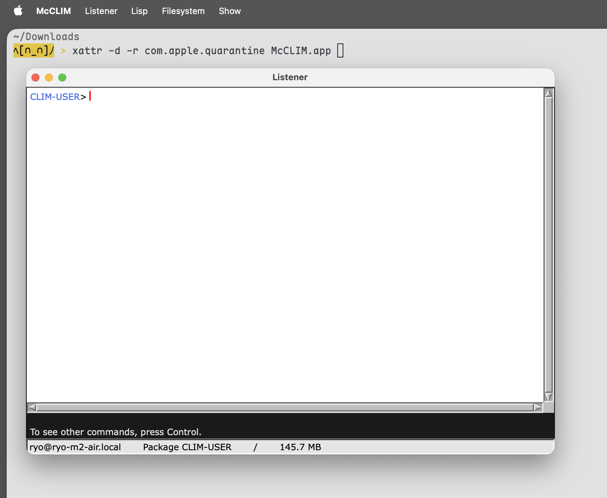

#+title: [CI Only] McCLIM-Coca.app
#+author: 凉凉
* About
This repo is just used to build [[https://codeberg.org/li-yiyang/McCLIM][McCLIM-Coca/App]].

You could find downloads in [[https://github.com/li-yiyang/McCLIM-Coca.app/releases][release]].
And all you need is a simple magic spell to shut up
Apple's warning:

#+begin_src shell
xattr -d -r com.apple.quarantine McCLIM.app
#+end_src

#+attr_html: :width 500px
#+caption: McCLIM Listener

